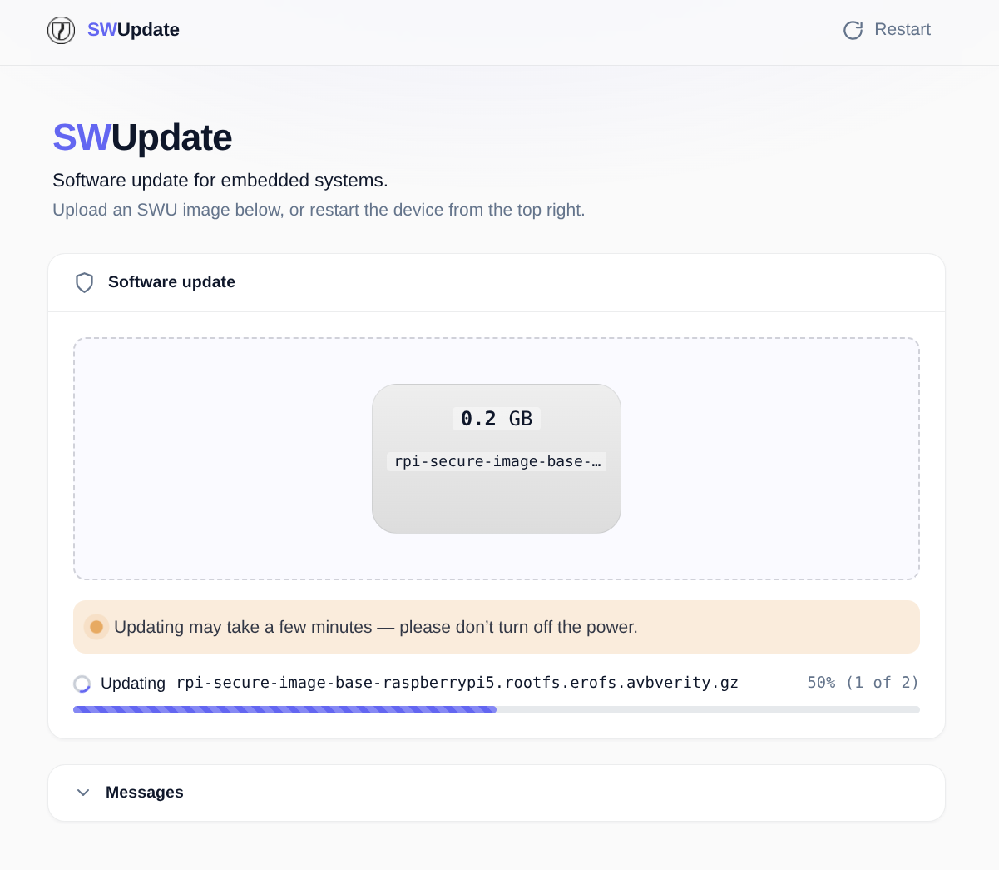

# meta-raspberrypi-secure

[](https://github.com/embetrix/meta-raspberrypi-secure/actions/workflows/oelint.yml)
[](LICENSE)

A Yocto layer that provides a security-hardened baseline for Raspberry Pi images, extending [meta-raspberrypi](https://github.com/agherzan/meta-raspberrypi/tree/master) layer with secure boot, verified and encrypted storage, runtime integrity and a hardened kernel and userspace.

> **Disclaimer:** This layer is a starting point, not a finished secure product. You are still responsible for threat modeling your product, removing unused software and services, tailoring defaults (SELinux, firewall, USBGuard, SW Updates, keys management) to your use case, performing license compliance checks, monitoring and remediating CVEs for all included software and independently testing the results. Moreover the maintainers accept no liability for bricked devices from incorrect OTP fuse programming, lost or leaked signing keys or misconfiguration. Provided as is with no warranty and no certification implied (see [LICENSE](LICENSE)).

## Features

- Hardware root of trust with signed boot chain anchored in the SoC boot ROM
- Read-only encrypted/authenticated rootfs with state isolated to data partitions
- Encrypted writable data partitions (dm-crypt + trusted key bound to the SoC)
- Runtime integrity via IMA/EVM
- A/B partitioning for atomic updates of boot and root slots
- OTA Update using SWUpdate
- Hardened kernel & userspace (SELinux, sysctl, systemd, OpenSSH, busybox)
- Network & USB protection (default-drop firewall, USBGuard)
- Optional TPM 2.0 support (Infineon SLB9670)
- Compliance & auditability (Audit, persistent logs, static code analysis, CVE scanning, SBOM)

## Secure Boot Flow

[](https://asciinema.org/a/jbYmoKMJjbeX6UBD)

## Quick Start

### 1. Generate signing keys

Generates Secure-boot, AVB-DMVerity, IMA/EVM, Kernel-Modules, SWUpdate and SSH-CA keys and writes a ready-to-use kas fragment `kas-signing-keys.yml`:

```sh
./tools/genkey-helper.sh
```

> **Warning:** store them securely and keep an offline backup even for development.

### 2. Configure the build

Two variables drive the build: `KAS_MACHINE` selects the target hardware (see [Supported Hardware](#supported-hardware)) and `SECURITY_PROFILE` selects the hardening level:

| Profile            | Use case | Behavior                                                                             |
|--------------------|----------|--------------------------------------------------------------------------------------|
| `dev` *(default)*  | Bring-up | Serial console, debug tweaks, IMA/EVM in log/fix mode, SELinux permissive            |
| `prod`             | Release  | Silent console, JTAG & device key locked, kernel/userspace hardening, enforcing IMA/EVM & SELinux, SSH cert-only auth |

### 3. Build

Two options:

* Standalone build directly from this layer using the provided kas configuration.

* Integrate into your own layer by adding:

```conf
# in your local.conf
DISTRO = "rpi-secure"
```

or add to your distro config:

```conf
require conf/distro/include/rpi-secure-distro.inc
```

#### Standalone build

Using [kas](https://kas.readthedocs.io/en/latest/userguide/getting-started.html) directly:

```sh
KAS_MACHINE=raspberrypi5 SECURITY_PROFILE=dev \
    kas build kas-rpi-secure.yml:kas-signing-keys.yml
```

Or using the [kas container](https://kas.readthedocs.io/en/latest/userguide/kas-container.html):

```sh
KAS_MACHINE=raspberrypi5 --runtime-args "-e SECURITY_PROFILE=dev" \
    kas-container build kas-rpi-secure.yml:kas-signing-keys.yml
```

### 4. Flash

Flash the image to an SD card or USB drive with [bmap-tools](https://github.com/yoctoproject/bmaptool):

```sh
sudo bmaptool copy \
    build/tmp/deploy/images/<MACHINE>/rpi-secure-image-base-<MACHINE>.rootfs.wic.bz2 \
    /dev/sdX
```

Or using [bmap-writer](https://github.com/embetrix/bmap-writer):

```sh
sudo bmap-writer \
    build/tmp/deploy/images/<MACHINE>/rpi-secure-image-base-<MACHINE>.rootfs.wic.bz2 \
    /dev/sdX
```

> **Warning:** replace with your block device: e.g. `/dev/sda` or `/dev/mmcblk0`

### 5. Enable Secure Boot

See the official Raspberry Pi [Boot Security How-to](https://pip-assets.raspberrypi.com/categories/1260-security/documents/RP-003466-WP-3-Boot%20Security%20Howto.pdf?disposition=inline) (PDF) for the underlying mechanism. On a device flashed with this layer, secure boot can be activated using the `rpi-secureboot` utility:

```sh
# Check current secure boot status
rpi-secureboot status

# Enable secure boot (stages signed EEPROM and reboots)
rpi-secureboot enable
```

This flashes a signed EEPROM image with `SIGNED_BOOT=1` via the recovery mechanism. Once enabled, only boot images signed with the key generated in step 1 will be accepted.

To make secure boot **permanent** (irreversible), the public key hash must be burned into OTP fuses this is not done automatically. While OTP fuses remain unprogrammed, secure boot can be toggled:

```sh
# Disable secure boot (only if OTP fuses are not programmed)
rpi-secureboot disable
```

> **Warning:** Programming OTP fuses is irreversible. Once burned, secure boot cannot be disabled and only firmware signed with the matching key will boot.

### 6. Provision Device-Unique ECDSA Key

Each device can generate a unique ECDSA key pair stored in OTP and could be used for device identity and TLS certificates backed by hardware:

```sh
rpi-fw-crypto genkey --key-id 1 --alg ec
```

> **Warning:** This is irreversible. The key is written once into OTP memory and can never be changed or erased.

The key is accessible via the [rpifwcrypto-pkcs11](https://github.com/embetrix/rpifwcrypto-pkcs11) PKCS#11 module for device identity and TLS operations and via the kernel trusted key subsystem for storage encryption (dm-crypt).

### 7. Software Update

The image ships [SWUpdate](https://github.com/sbabic/swupdate) with its web interface, exposed over HTTPS through an nginx reverse proxy (TLS terminated with the device-unique key from step 6 and behind basic auth, default user `rpi`).

Open the SWUpdate web UI in a browser:

```
https://<device-ip>/swupdate/
```

Upload the `.swu` artifacts built alongside the image (signed with the SWUpdate key from step 1 and encrypted):

```sh
build/tmp/deploy/images/<MACHINE>/rpi-secure-image-base-update-<MACHINE>.rootfs.swu
```



> **Note:** The EEPROM update are shipped as separate `.swu` file and can be applied independently

## Layers dependencies

- [openembedded-core (core)](https://git.openembedded.org/openembedded-core/log/?h=wrynose)
- [meta-raspberrypi](https://git.yoctoproject.org/meta-raspberrypi/log/?h=master)
- [meta-openembedded](https://github.com/openembedded/meta-openembedded/tree/wrynose)
- [meta-security](https://git.yoctoproject.org/meta-security/log/?h=wrynose)
- [meta-selinux](https://git.yoctoproject.org/meta-selinux/log/?h=wrynose)
- [meta-avb](https://github.com/embetrix/meta-avb/tree/wrynose)
- [meta-sca](https://github.com/priv-kweihmann/meta-sca/tree/master)
- [meta-swupdate](https://github.com/sbabic/meta-swupdate/tree/wrynose)

## Supported Hardware

| Model                       | MACHINE                      | Status                 |
|-----------------------------|------------------------------|------------------------|
| Raspberry Pi 5                | `raspberrypi5`               | Tested                 |
| Raspberry Pi 4 Model B / CM4  | `raspberrypi4-64`            | Tested (CM4 untested)  |
| Compute Module 5 (IO Board)   | `raspberrypi-cm5-io-board`   | Supported, not tested  |

> **Note:** Other Raspberry Pi variants (Pi 3, Pi Zero, etc.) lack the hardware security features this layer relies on (OTP-backed signed boot, hardware-bound device key) and will not be supported.

## Commercial Support

This layer is maintained by [Embetrix](https://embetrix.com), which provides extended services and consulting around it including: custom integration, security audits, secure-boot key-management and provisioning, OTA update solutions, certificate management (PKI, device identity), long-term maintenance and CVE backports. Get in touch at [info@embetrix.com](mailto:info@embetrix.com).

## License

This project is licensed under the MIT License see the [LICENSE](LICENSE) for details.
